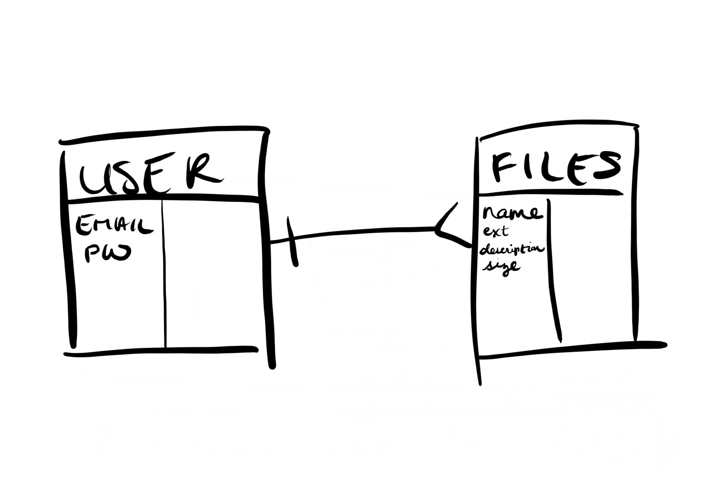

# Image Uploader(client): BOS.EATS

BOS.EATS is an application where users can upload and store images relating to the
food scene within the city of Boston. Images from all users are available for viewing
to any users. Users are only able to update and delete their own images, however.
For scalability, the application is not limited to only Boston but can be used in any
city around the world.

   [Click here to see our deployed site](https://ga-sei-05-yass.github.io/team-project-client/)  
   [Back-end repository](https://github.com/ga-sei-05-yass/team-project-api)[/ deployed site](https://arcane-temple-01908.herokuapp.com/)

### Planning and Process

This is a team project that focuses on full-stack development. This repository is
the front-end component. We are a team of 4 developers. We primarily split up into
2 pairs, one pair focusing on front-end and another focusing on back-end. After
initial development, we served as quality control for the other pair.

We implemented agile development with the use of Scrum. We held daily stand-ups
within our 3-day sprint. The goal for this sprint was to meet the MVP outlined within
our user stories.

### Technologies Used

In this project, we utilized HTML, CSS, and Javascript in our corework. We've also
integrated the use of Bootstrap, Handlebars, and Jquery as well.

### User Stories

1. As a user, I would like to be able to sign up for the application using an email, password, and password verification.
2. As a user, I would like to be able to sign in using an email and password.
3. As a signed-in user, I would like to be able to change my password using my old password and new password.
4. As a signed-in user, I would like to be able to change my password but not when signed out.
5. As a signed-in user, I would like to be able to sign out of the application.
6. As a signed-in user, I would like to be able to select an image file from my computer via GUI to select a file to upload, and store it on AWS.
7. As a signed-in user, I would like to be able to see ALL images from different users.
8. AS a signed-in user, I would like to be able to see the details (name, description, timestamps, & tag) of individual image.
9. As a signed-in user, I would like to be able to to update the details of _only_ my image.
10. As a signed-in user, I would like to be able to delete my _own_ image from the database and no one else's.

### Unsolved Problems

1. For updating images, we'd like to have a customized modal for each individual image.
2. Upon sign-in, upload, update, and delete, we'd like to have the gallery simultaneously refreshes the content.
3. Currently, photos have a property for "tag." In future iteration, we'd like to have a search function for different tags.

### Wireframes:

### ERD

